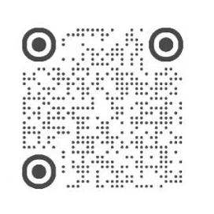

# Pocketeez 02 — Cap' Jjoong ⚓

> *A tiny squirrel captain living on your desktop.*

**Pocketeez 系列的第 02 只桌面伙伴**

戳戳脸颊、摸摸尾巴、和它打个招呼…… Cap' Jjoong 会给你不同的反应 ♡

猜猜哪个动作会触发**图中的动作**呢？

本版本共设计了 **8 种互动**，欢迎慢慢解锁～

---

## 💜 Pocketeez Series

**Pocketeez** 是由 **Be.honest.** 制作的像素桌宠系列，一共8只，名字来自 **Pocket + TEEZ**。

希望把一群小小的角色“装进口袋”，在学习、工作、写论文或赶 ddl 的时候，放到电脑桌面上陪伴 ATINY。

每一只 Pocketeez 都会拥有自己的角色设计、互动方式和独立版本。

### 👉 [前往 Pocketeez 系列主页了解详情](https://github.com/Behonest1117/Pocketeez)

### 🗺️ 项目进展：

目前已发布：

01 | **-3- Deokki**

02 | **Cap' Jjoong**

03-8 | To be continue...

---

## 💻 下载 Cap' Jjoong

**当前正式版本：v1.1.6**  
**适用平台：Windows**

### 👉 [下载最新版 Cap' Jjoong ⚓](https://github.com/Behonest1117/Cap-Jjoong-desktop-pet/releases/latest)

下载完成后，双击 `Cap-Jjoong-Setup-v1.1.6.exe`，按照提示完成安装即可 ♡

> 💡 第一次安装或运行时，如果 Windows 弹出安全提示，请确认文件来自本仓库后再继续。

---

## 🐿️ 关于 Cap' Jjoong

Cap' Jjoong 是一只住在电脑桌面上的松鼠船长。

- **Cap'** 是Captain的英文缩写
- **Jjoong** 来自 JJOONGrami

平时它会乖乖待在你的桌面上。和它互动时，例如戳戳脸颊、摸摸尾巴、和它打个招呼，Cap' Jjoong 会给你不同的小动作和反应。

希望梯尼在工作、学习的时候，这只小小的 Cap' Jjoong 会一直陪着你 ♡

---

## ✨ 互动预览

不同的互动方式会触发 Cap' Jjoong 不同的小动作和反应。

一共 **8 种互动**，暂不公布，就留给各位梯尼慢慢发现 ♡

---

## 💌 开发者自述

Created and developed by **Be.honest.** ♡

Pocketeez 是一个长期开发的非商业粉丝自制项目。希望这些小小的桌面伙伴，能在学习、工作、写论文或赶 ddl 的时候陪着你。

我会继续产出Pocketeez系列，欢迎大家持续关注

非常希望你能告诉我使用反馈、遇到的 bug，以及你想让**Pocketeez**们学会的新东西 ♡

---

## 💜 小红书｜How to Find Me

**Be.honest.**

**小红书 App 扫码，可以找到我**

---

本项目为非商业粉丝自制作品，并非官方产品，与艺人及所属公司无官方关联。  
This is an unofficial, non-commercial fan-made project and is not affiliated with the artists or their company.
